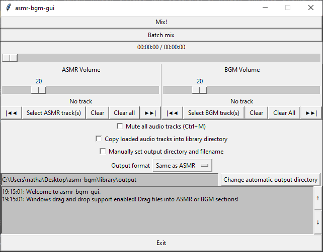

tkinter GUI that lets the user select two audio sources (an ASMR track and a BGM track) for mixing, preview the final product while adjusting track volumes, and writes the result into a new audio file using ffmpeg.

command-line tool is WIP.
